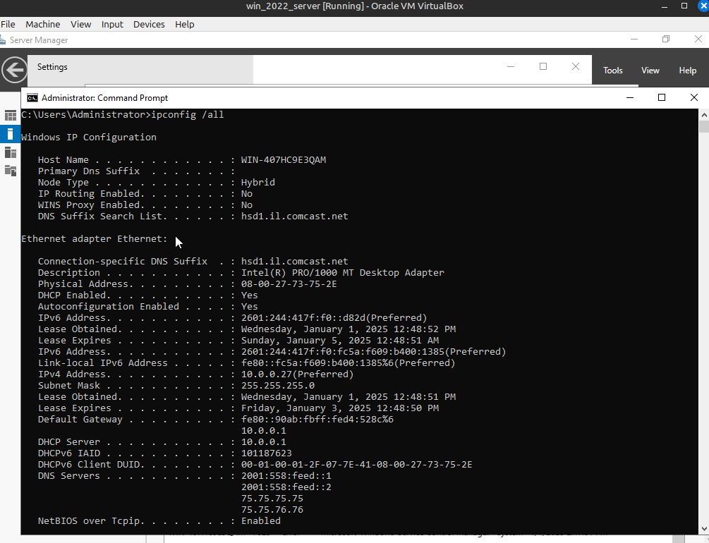

# Installing Active Directory

## Set up virtual machine with Windows 2022 Server Evaluation Version with Virtual Box

For the Windows Server 2022 machine virtual machine setup, open up virtual box and click new at the top of the window toolbar. 

Name your machine, select the folder where your machine and files will be saved, select your ISO file, skip the unattended installation and then click next.

Since this is not going into production, keep the Hardware as the deaults, but adjust according to your needs.

Set the size of your virtual hard disk adjust according to your needs. Click next and then verify the settings.

Once the machine is setup before starting your machine, go to your machines system settings.  This can be achieved either right clicking on your machine and clicking settings.  Or you can highlight your machine and then click the settings button at the top of the virtual box toolbar

In the system settings, remove the floppy drive from the boot order and move the hard disk to the top and the optical disk second.

In your network settings, adjust adapter 1 so it is a Bridged adapter.  You can adjust to your own needs.  Since I am using my own home router, I am using the Bridged network, basically the bridge allows my virtual machine to interact with other devices on my home network as though it is a physical machine. 

Once those settings are saved start your machine clicking start at the top of the virtual box menu.  Your machine will start and begin installing the Windows Server 2022.  The initial prompt click next

Select the standard evaluation version with desktop experience.  If you want a smaller sized OS and only command line access install the version without the desktop experience.

Click **Custom: Install Microsoft Server Operating System Only** if it is a fresh install, if you are upgrading click **Install Microsoft Server Operating System and keep files, settings, and applications**

**Be aware, installing the OS will delete everything on your hard drive**
If this is a fresh install and have no files, you do not need to worry.  If you are installing this on your actual working computer or have files you want to keep, make backups of everything and select upgrade.

